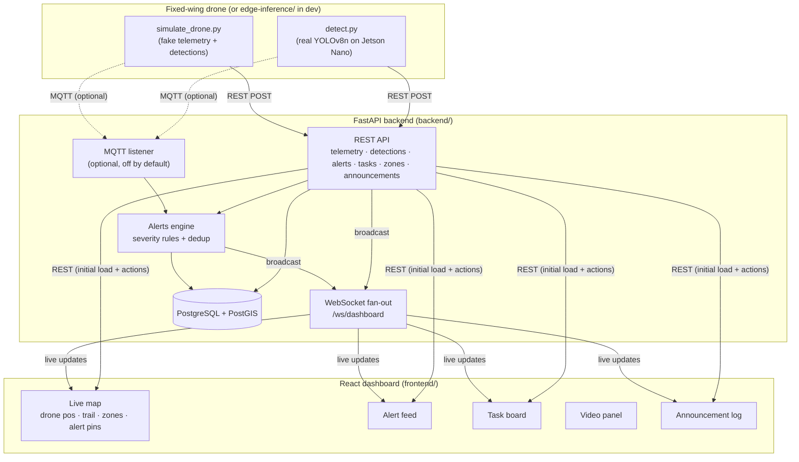

# Disaster Mission Control System

[](https://github.com/agastyasharma20/disaster-mission-control/actions/workflows/ci.yml)
[](LICENSE)

project software backbone for Soaring Aerotech's disaster-response control vehicle: surveillance drone telemetry + AI scene detection → alerts → logistics/rescue task board → live mission-control dashboard, modeled loosely on Air Force mission-control protocols.

Full requirements/design are in [`docs/proposal.md`](docs/proposal.md) — that's the source spec this repo implements. This README covers running and extending what's built.

## Architecture



**Edge side (Jetson Nano):** runs a lightweight object/scene detection model (YOLOv8n or similar) on the drone video stream, detects classes relevant to disaster response (`person`, `fire`, `smoke`, `flood_water`, `vehicle`, `collapsed_structure`), and pushes detection events + telemetry to the backend.

**Cloud/control side:** FastAPI backend stores telemetry, detections, alerts and tasks, and pushes every change to the dashboard over one WebSocket channel; React dashboard visualizes everything in near real time.

## What's implemented

- **Backend** (`backend/`) — FastAPI app with full REST API (telemetry, detections, alerts, tasks, zones, announcements), a WebSocket fan-out at `/ws/dashboard`, and an alerts engine that classifies severity by object type and dedups repeat detections of the same object within a time/distance window (proposal §4.3). REST and the optional MQTT listener both write through the same `app/services/ingestion.py` functions, so behavior is identical regardless of transport. Tables are created automatically on startup (no Alembic yet — fine for a demo, see below).
- **Edge inference** (`edge-inference/`):
  - `simulate_drone.py` — flies a fake circular patrol, posts telemetry + occasional random detections. This is what makes the whole system demoable with zero hardware.
  - `detect.py` — real YOLOv8n pipeline over a webcam/video/RTSP source, publishing to the same endpoints. Stock COCO classes are mapped to the proposal's disaster classes as a placeholder until a fine-tuned model exists (see comments in the file).
  - Which one is "live" is just a config flag (`AI_SOURCE=simulated|jetson` in `backend/app/config.py`) — the backend and dashboard don't change either way.
- **MQTT ingestion** (`backend/app/mqtt_client.py`) — optional, off by default (`MQTT_ENABLED=false`). Subscribes to `drone/{id}/telemetry` and `drone/{id}/detections` and writes through the exact same ingestion path as the REST endpoints. Turn it on once a real drone/ground station publishes over MQTT instead of calling REST directly.
- **Frontend** (`frontend/`) — React + TypeScript + Leaflet dashboard: live map (drone position, flight trail, disaster-zone polygon, alert pins by severity), alerts feed with acknowledge action, task board (create from an alert, advance through pending → dispatched → in_progress → completed), announcement log, and a video panel placeholder (shows the latest detection until a real stream is wired up).
- **Tests** (`backend/tests/`) — pytest suite covering the REST API (telemetry, detections → alerts, task lifecycle) and the alerts engine's severity classification + spatial/time dedup logic, run against an in-memory SQLite DB so no Postgres instance is needed in CI.
- **CI** (`.github/workflows/ci.yml`) — GitHub Actions: backend tests, frontend typecheck + build, edge-inference syntax check, on every push/PR.

## Not implemented (stretch goals, see proposal §11)

Real drone flight control/MAVLink, real PA hardware + TTS, real payload-drop actuation, multi-drone swarm coordination, auth/roles, offline-first mode, Alembic migrations, real PostGIS geometry columns for zones (currently stored as JSON boundary arrays — see `backend/app/models/__init__.py::Zone`).

## Running it

### Option A — Docker Compose (recommended)

```bash
docker compose up --build
```

- Backend: http://localhost:8000 (interactive API docs at `/docs`)
- Frontend: http://localhost:5173
- Postgres/PostGIS: localhost:5432 (`mission`/`mission`/`mission_control`)

Then, in separate terminals, seed a sample disaster zone and start the simulated drone so there's something to see:

```bash
# seed a sample zone polygon onto the map
pip install requests
python scripts/seed_demo_data.py

# fly the fake drone
cd edge-inference
pip install -r requirements.txt
python simulate_drone.py
```

Open http://localhost:5173 — you should see the disaster-zone outline, the drone patrolling with a flight trail, alerts appearing as it "spots" things, and you can turn an alert into a task from the task board.

### Option B — run everything locally (no Docker)

```bash
# 1. Postgres with PostGIS must be reachable at the URL in backend/.env (copy from .env.example)
cd backend
python -m venv .venv && .venv/Scripts/activate   # or source .venv/bin/activate on macOS/Linux
pip install -r requirements.txt
uvicorn app.main:app --reload

# 2. In another terminal
cd frontend
npm install
npm run dev

# 3. In another terminal
python scripts/seed_demo_data.py
cd edge-inference
pip install -r requirements.txt
python simulate_drone.py
```

### Running the tests

```bash
cd backend
pip install -r requirements-dev.txt
pytest -q
```

No Postgres needed — the suite runs against an in-memory SQLite DB (see `backend/tests/conftest.py`).

### Pointing at a real Jetson Nano feed later

Set `AI_SOURCE=jetson` in the backend env (informational — it doesn't gate any code path, it's just how the system records which source is authoritative), and run `edge-inference/detect.py --source rtsp://<drone-ip>/stream --model <fine-tuned-weights>.pt` on the Jetson instead of `simulate_drone.py`. It POSTs to the exact same `/api/detections/{drone_id}` endpoint, so nothing in the backend or dashboard needs to change.

### Switching telemetry/detections to MQTT

Set `MQTT_ENABLED=true`, `MQTT_BROKER_HOST`, `MQTT_BROKER_PORT` in the backend env, run a broker (e.g. `docker run -p 1883:1883 eclipse-mosquitto`), and publish JSON payloads (same shape as the REST bodies below) to `drone/{drone_id}/telemetry` / `drone/{drone_id}/detections`. See `backend/app/mqtt_client.py`.

## API surface

See `backend/app/api/` for the full routers, or `/docs` once the backend is running. Summary:

```
POST   /api/telemetry/{drone_id}
GET    /api/telemetry/{drone_id}/latest
POST   /api/detections/{drone_id}
GET    /api/alerts?severity=&status=
PATCH  /api/alerts/{id}
POST   /api/tasks
GET    /api/tasks?status=
PATCH  /api/tasks/{id}
GET    /api/zones
POST   /api/zones
GET    /api/announcements
POST   /api/announcements
WS     /ws/dashboard
```

## Repository layout

```
disaster-mission-control/
├── backend/
│   ├── app/
│   │   ├── main.py            FastAPI app + lifespan + WS endpoint
│   │   ├── config.py           Settings (DB URL, AI_SOURCE, MQTT flags)
│   │   ├── database.py         Async engine/session, init_db()
│   │   ├── db_types.py         Portable GUID column type (Postgres UUID / SQLite CHAR)
│   │   ├── models/             SQLAlchemy models
│   │   ├── schemas.py          Pydantic request/response models
│   │   ├── api/                REST routers: telemetry, detections, alerts, tasks, zones, announcements
│   │   ├── services/           ingestion.py (shared write path) + alerts_engine.py (severity/dedup)
│   │   ├── ws/manager.py        WebSocket fan-out
│   │   └── mqtt_client.py       Optional MQTT ingestion path
│   ├── tests/                  pytest suite (API + alerts engine)
│   ├── requirements.txt / requirements-dev.txt
│   └── Dockerfile
├── edge-inference/
│   ├── simulate_drone.py       Fake telemetry + detections (dev/demo)
│   ├── detect.py                Real YOLOv8n pipeline (Jetson Nano / webcam / RTSP)
│   └── requirements.txt
├── frontend/
│   ├── src/
│   │   ├── components/          MapView, AlertFeed, TaskBoard, VideoPanel, AnnouncementLog
│   │   ├── hooks/useWebSocket.ts
│   │   ├── api.ts / types.ts
│   │   └── App.tsx
│   └── package.json
├── scripts/seed_demo_data.py   Seeds a sample disaster-zone polygon
├── docs/proposal.md            Full project proposal (source spec)
├── .github/workflows/ci.yml    Backend tests, frontend build, edge-inference syntax check
└── docker-compose.yml
```

## Screenshots

_Not included yet — once you have the stack running (Docker Compose or local), drop screenshots of the live map and task board here for your project report/README._
